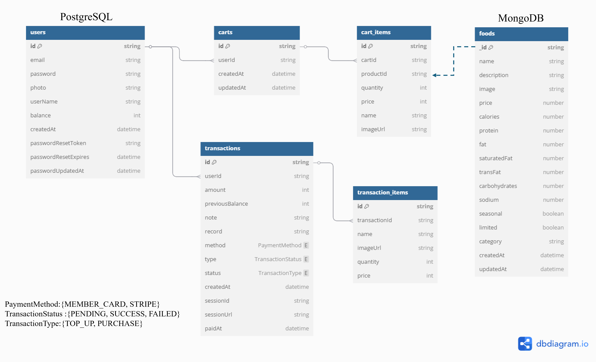
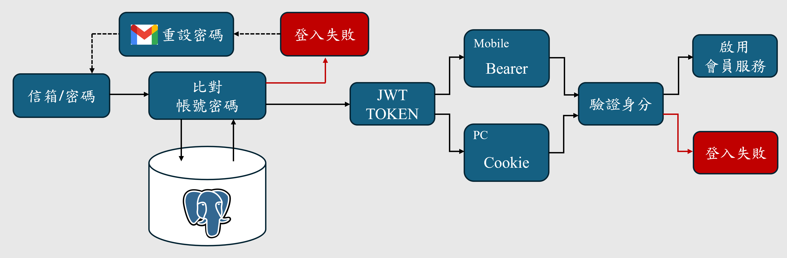
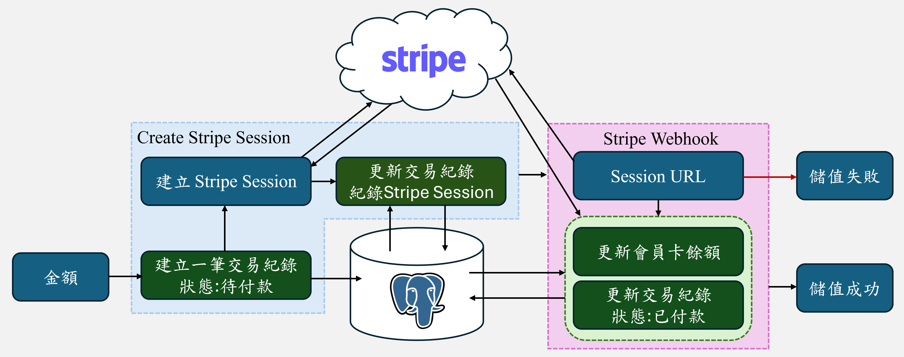

# MØSBurger-Backend
# 1.簡介
這是模擬電商平台常見功能的全端專案，包含商品展示、帳戶驗證、會員管理和線上購物。支援信用卡和會員卡兩種支付方式，並搭配完善的資料流程提供用戶最好的體驗。

本篇將以介紹後端功能與架構為主

# 2.系統功能
本系統有四大核心功能：商品展示、帳戶驗證、會員管理、線上購物。

### 商品展示
- **展示功能**：顯示各商品的詳細資訊
- **排序功能**：商品可依照價格和卡路里排序
- **搜尋功能**：根據關鍵字搜尋商品
- **下單功能**：登入成功後可將商品加入購物車

### 帳戶驗證
- **註冊功能**：建立專屬帳號
- **登入功能**：登入後可使用會員功能
- **忘記密碼**：寄送 email 驗證信重設密碼

### 會員管理
- **會員資訊**：顯示使用者名稱、會員卡面和會員卡餘額
- **儲值功能**：經由第三方金流（Stripe）儲值會員卡
- **交易明細**：紀錄會員卡交易紀錄
- **歷史訂單**：紀錄曾購買的商品詳情
- **更改密碼**：可更改密碼，並於下次登入生效
- **編輯會員資訊**：可修改使用者名稱和會員卡面

### 線上購物
- **購物車**：紀錄預計購買的商品，同時也可以修改商品數量
- **結帳功能**：可填寫備註並選擇以會員卡或信用卡付款

# 3.技術
**程式語言**：TypeScript

**前端技術**：React、TailwindCSS、shadcn/ui

**後端技術**：Node.js(Express)

**資料庫與ORM**：MongoDB(Mongoose)、PostgreSQL(Prisma)

**開發工具與環境**：Git、VS Code、Docker、WSL

**第三方服務**：Gmail API、Stripe、Cloudinary

**驗證與安全**：JWT、express-validator、Zod

# 4.資料庫

圖4.1：資料庫設計圖。

本系統的資料類型可分為：

**商品資訊**：本系統採用MongoDB儲存商品資訊，因為NoSQL的結構具高度彈性，能有效應對商品資料的多元屬性。若未來要擴充特定商品的屬性，僅需要在指定商品進行擴充，不會影響資料庫的整體架構，降低維護和修改成本。

**用戶資訊**：本系統採用PostgreSQL儲存用戶資訊，因為SQL具備ACID特性，可確保資料處理的一致性。由於會員服務涉及金流操作，例如儲值會員卡和線上購物，透過SQL可保障交易行為的正確性，避免資料異常導致不必要的消費糾紛。

# 5.系統流程
## 5.1 登入

圖5.1：登入流程圖。

本系統支援電腦端和行動端的兩種方式登入。使用者輸入信箱和密碼後，系統會比對資料庫中的用戶資訊，若沒有相符的資料，則視為登入失敗。如果只是忘記密碼，使用者可透過系統發送gmail驗證信重新設定密碼，再次嘗試登入。

當系統確認帳號密碼皆正確時，系統會生成JWT Token，根據登入裝置類型發送不同的憑證：電腦端會使用COOKIE，行動端則使用Bearer Token。後續請求皆會驗證該憑證以確認身分，方可啟用會員服務。如果憑證無效或逾期，則視為登入失敗。

## 5.3 會員卡儲值

圖5.3：會員卡儲值流程圖。

本系統使用Stripe作為第三方金流服務，而完成會員卡儲值需要經過兩個步驟:

Create Stripe Session: 當用戶決定儲值金額後，系統會建立一筆狀態為「待付款」的交易紀錄，隨後向Stripe請求對應的Stripe Session，該Session包含交易資訊和付款網址。之後系統會將Session的資訊記錄於先前建立的交易紀錄，以便後續狀態追蹤和金流對帳。

Stripe Webhook: 當用戶於付款網址成功付款，Stripe會主動透過Webhook通知系統付款結果，系統收到通知後會根據Session驗證交易結果，如果驗證通過，則更新會員卡餘額和將交易狀態為「已付款」。反之，若付款未完成，則不會進行任何更新，交易狀態仍維持為「待付款」。